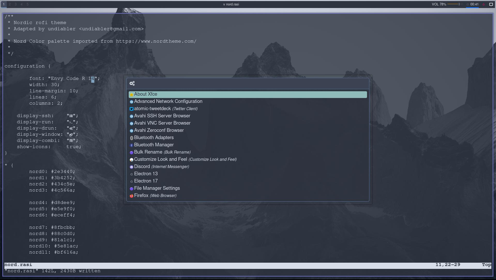

# Ansible Arch setup


# WARNING THIS WILL OVERWRITE YOUR DOTFILES! 


Ansible arch setup that automate installing and grabing dotfiles for a fresh arch install.
Used ALG BSPWM (arch linux gui) but should work with other arch distros

https://archlinuxgui.in/download.html#sec-7


1. Update arch and install requirement
```sh
sudo pacman -Suy
sudo pacman -S git ansible
```
2. Clone reposetory
```sh
git clone https://github.com/Alzaron/ansible-arch.git
```
3. Change username or make username none Ansible-Arch/roles/common/vars/main.yml 
```sh
vim ~/ansible-arch/roles/common/vars/main.yml 
```
cd ansible-arch/roles
```
4. Cd into folder
```sh
cd /ansible-arch/roles
```
5. Run playbook
```sh
ansible-playbook -K main.yml
```
6. start restart terminal restart terminal


Usefull ketbindings:

``` bindings
super + q = quit
super + w = firefox
super + d = program menu
super + n = file browser
super + return = terminal
super + 
super + 
super + 

super and hold right mouse button = resize window
super and hold left mouse button = move window posision
```
to see all bindings:
```bash
mybindings
```
to see all zsh terminal alias and settings
```sh
zshconf
```# HyprArch-Ansible
